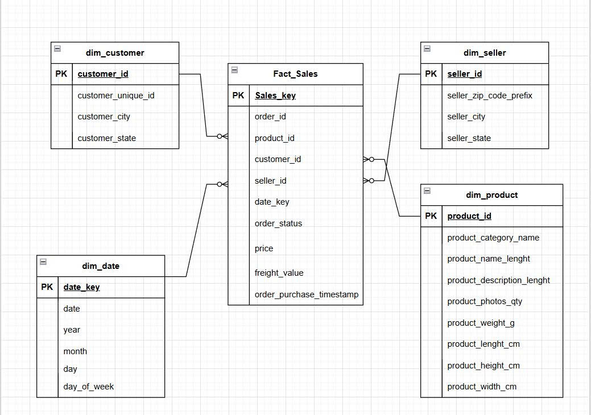

# 🚀 Modern E-commerce Data Lakehouse
## 📌 Overview

The **Modern E-commerce Data Lakehouse** project builds an **end-to-end data processing and analytics system** for e-commerce data, based on a **modern Data Lakehouse architecture**.

The system follows the **Medallion Architecture (Bronze – Silver – Gold)**, enabling:

* Clear separation between raw, cleaned, and analytics-ready data
* Clean, consistent, and historical data tracking
* Data readiness for analytics, reporting, and BI use cases

---

## 🎯 Project Objectives

* Build an **end-to-end data pipeline** for e-commerce data
* Ingest and process large-scale data in a **scalable and efficient** manner
* Ensure **data quality** throughout the pipeline
* Store analytics data using **Star Schema modeling**
* Track historical data changes using **Slowly Changing Dimension (SCD) Type 2**
* Enable **high-performance SQL analytics** on a Lakehouse platform

---

## 🏗️ High-Level Architecture

```text
Seed / Raw Data
      ↓
Apache Spark
      ↓
Bronze Layer (Iceberg)
      ↓
dbt (Cleaning & Standardization)
      ↓
Silver Layer (Iceberg)
      ↓
dbt (Star Schema + SCD Type 2)
      ↓
Gold Layer (Iceberg)
      ↓
Trino / BI / Analytics
```

---

## 🧩 Core Components

* **Apache Spark** – Distributed data ingestion and processing
* **Apache Iceberg** – Lakehouse table format
* **dbt** – Data transformation and modeling
* **Apache Airflow** – Workflow orchestration
* **MinIO** – S3-compatible object storage
* **Project Nessie** – Versioned metadata management for Iceberg
* **Trino** – Distributed SQL query engine for analytics

---

## ⭐ Star Schema Design (Gold Layer)

The Gold layer is modeled using a **Star Schema**, optimized for analytical workloads and BI tools.



---

## ▶️ Usage Guide

### 1️⃣ Prerequisites

Make sure the following tools are installed:

* Docker & Docker Compose
* Git

---

### 2️⃣ Clone the Repository

```bash
git clone https://github.com/your-username/modern-ecommerce-data-lakehouse.git
cd modern-ecommerce-data-lakehouse
```

---

### 3️⃣ Start the Infrastructure

```bash
docker-compose up -d
```
---

### 4️⃣ Service Configuration

#### 🔹 MinIO

* URL: [http://localhost:9001](http://localhost:9001)
* Create a bucket: **warehouse**

#### 🔹 Apache Airflow

* URL: [http://localhost:8082](http://localhost:8080)
* Enable and trigger the DAG: **`ecommerce_dag_pipeline`**

Once triggered, the pipeline will automatically execute the full workflow from **Bronze → Silver → Gold**.


